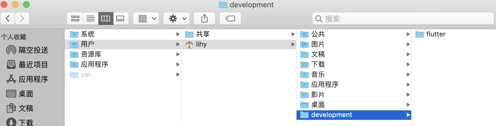
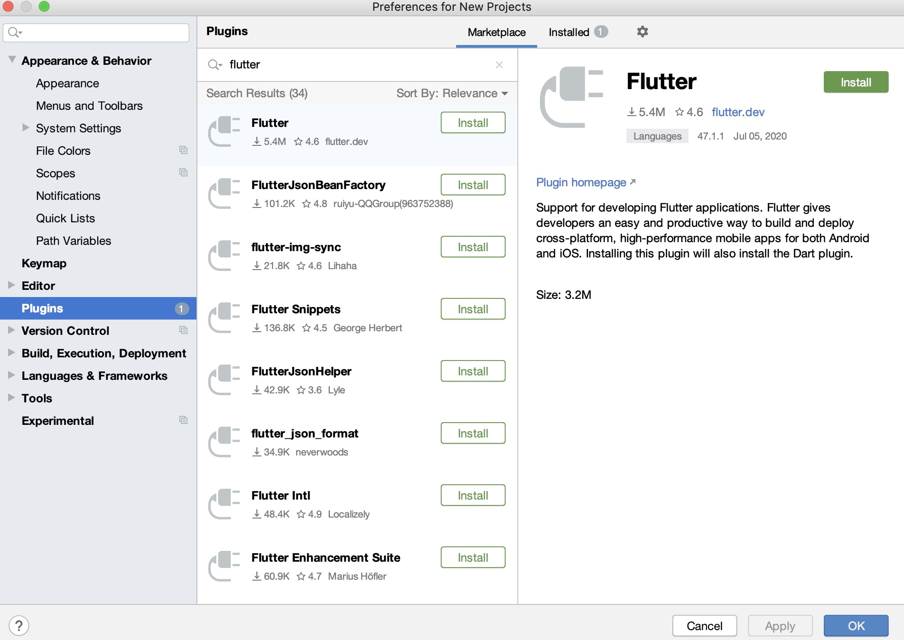

# 下载SDK

官网地址：https://flutter.dev/docs/get-started/install/macos

目前版本：flutter_macos_1.17.5-stable.zip

将下载下来的SDK文件解压缩至指定目录，我放在用户目录中的development文件夹下，这个路径后面会用到：



解压缩路径：`/Users/lihy/development/flutter `

# 配置环境变量

在终端输入 `vi ~/.bash_profile`，按 `i` 进入编辑模式，添加如下代码：

```ini
# flutter-国内镜像
export PUB_HOSTED_URL=https://pub.flutter-io.cn
export FLUTTER_STORAGE_BASE_URL=https://storage.flutter-io.cn
# flutter-环境变量
export PATH=/Users/lihy/development/flutter/bin:$PATH
```

刷新配置文件：

```shell
$ source ~/.bash_profile 
```

验证结果：

```shell
$ flutter -h
```

这一过程可能会比较久，请耐心等待，如果出现flutter帮助指南，或者看到如下提示语即表示成功。

```shell
Welcome to Flutter! - https://flutter.dev     
```

# 检查环境

运行以下命令以查看是否需要安装任何依赖项才能完成设置。

```shell
$ flutter doctor
```

此命令检查您的环境并向终端窗口显示报告。

```shell
Doctor summary (to see all details, run flutter doctor -v):
[✓] Flutter (Channel stable, v1.17.5, on Mac OS X 10.15.3 19D76, locale
    zh-Hans-CN)
[!] Android toolchain - develop for Android devices (Android SDK version 28.0.3)
    ✗ Android license status unknown.
      Try re-installing or updating your Android SDK Manager.
      See https://developer.android.com/studio/#downloads or visit visit
      https://flutter.dev/docs/get-started/install/macos#android-setup for
      detailed instructions.
 
[✓] Xcode - develop for iOS and macOS (Xcode 11.5)
[!] Android Studio (version 3.6)
    ✗ Flutter plugin not installed; this adds Flutter specific functionality.
    ✗ Dart plugin not installed; this adds Dart specific functionality.
[!] VS Code (version 1.46.1)
    ✗ Flutter extension not installed; install from
      https://marketplace.visualstudio.com/items?itemName=Dart-Code.flutter
[!] Connected device
    ! No devices available

! Doctor found issues in 4 categories.
```

按照检测结果的说明，如果有 `[!]` 或者 `✗`  标志，表示本行检测不通过，需要做一些设置或者安装一些软件。

## 1. 下载安装  Android Studio

```
✗ Android license status unknown.
```

下载地址：https://developer.android.com/studio/#downloads

接下来在配置文件里添加如下代码：

```ini
# android
export ANDROID_HOME=$HOME/Library/Android/sdk 
export PATH=$PATH:$ANDROID_HOME/tools
export PATH=$PATH:$ANDROID_HOME/tools/bin
export PATH=$PATH:$ANDROID_HOME/platform-tools
export PATH=$PATH:$ANDROID_HOME/emulator
```

## 2. 安装插件

```
✗ Flutter plugin not installed; this adds Flutter specific functionality.
✗ Dart plugin not installed; this adds Dart specific functionality.
```

打开android studio，找到个人偏好设置，快捷键 `cmd + ,` ，选中Plugins项，输入 flutter，点击install。



配置Android，一路按 `y` 即可：

```shell
$ flutter doctor --android-licenses
```

此时，安卓环境已经OK。

```
[✓] Android toolchain - develop for Android devices (Android SDK version 28.0.3)
```

## 3.  VS Code

```
 VS Code (version 1.46.1)
    ✗ Flutter extension not installed; install from
      https://marketplace.visualstudio.com/items?itemName=Dart-Code.flutter
```

flutter 官方推荐的编辑器有Android Studio和VSCode，个人感觉 VSCode 开发体验比较好。

下载安装：https://code.visualstudio.com/

打开VSCode，快捷键CMD + SHIFT + X 打开拓展程序，搜索并安装 Dart/Flutter 插件。然后再次执行 `flutter doctor` 指令，配置完毕！

```shell
$ flutter doctor 
Doctor summary (to see all details, run flutter doctor -v):
[✓] Flutter (Channel stable, v1.17.5, on Mac OS X 10.15.3 19D76, locale
    zh-Hans-CN)
[✓] Android toolchain - develop for Android devices (Android SDK version 28.0.3)
[✓] Xcode - develop for iOS and macOS (Xcode 11.5)
[✓] Android Studio (version 3.6)
[✓] VS Code (version 1.46.1)
[✓] Connected device (1 available)

• No issues found!
```

# 开发

## 1. 新建项目

```shell
$ flutter create xxxx
$ cd xxx
$ flutter run
```


